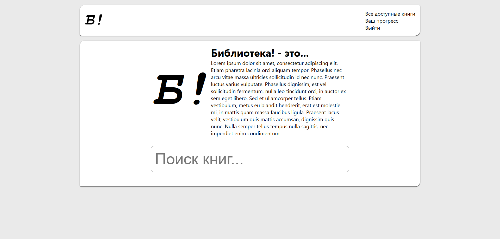
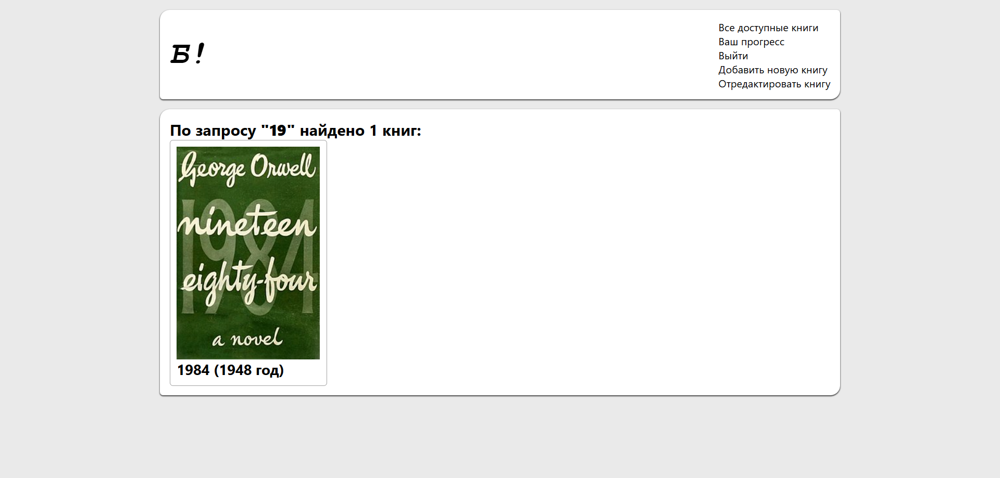
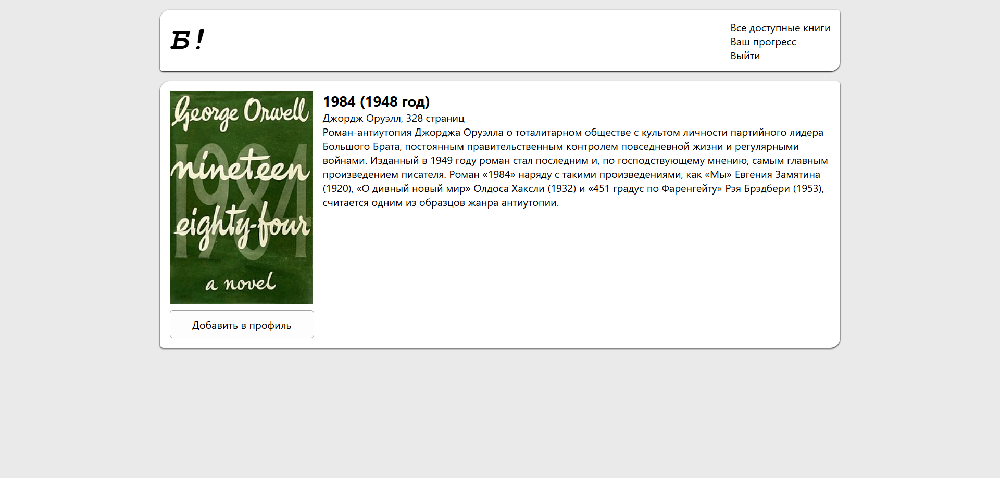
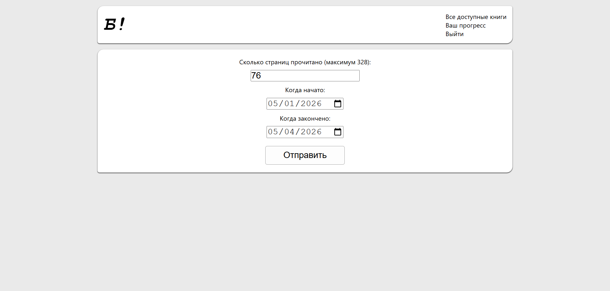
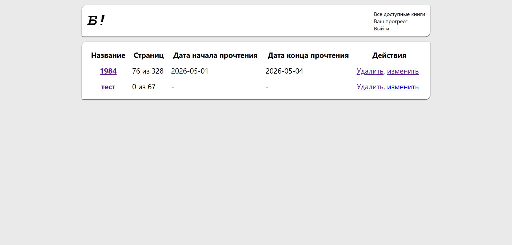
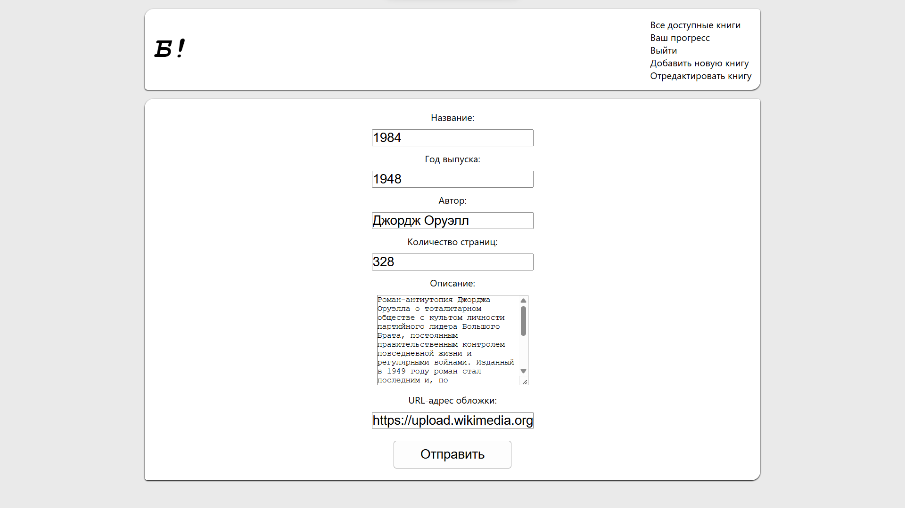

# Библиотека! (biblio-top)

## Скриншоты








## Использование

### Подготовка к развёртке

> [!NOTE]
> Это необходимо сделать только один раз.

В первую очередь необходимо создать новую базу данных SQLite3 под названием `main.db`, выполнить все команды с файла `init_db.txt` и разместить файл в папку с проектом. Создайте пользователя в таблице `readers`, при необходимости дав ему права администратора значением `1` в `is_admin`. Затем откройте терминал и выполните данную команду:

```bash
py -3 -c "import secrets; print(secrets.token_hex())"
```

Она предназначена для использования в сессиях браузера. Скопируйте полученное значение и вставьте в файл `app.py` заменив `CHANGE_KEY_HERE`, чтобы получить следующее:

```python
# Генерировать с помощью команды `py -3 -c "import secrets; print(secrets.token_hex())"`
app.secret_key = b'dc566b25c26ac0f2d5a96321a155c41133ecdc8409ff868ec063a2c3e8414e75'
```

Теперь для получения необходимых зависимостей, необходимо выполнить данные команды:

```bash
py -3 -m venv .venv
.venv\Scripts\activate
pip install Flask
```

### Развёртывание

Теперь, когда всё готово, запустить приложение можно данными командами (для перехода в режим откладки необходимо добавить флаг `--debug` в команду `flask run`):

```bash
.venv\Scripts\activate
flask run
```
